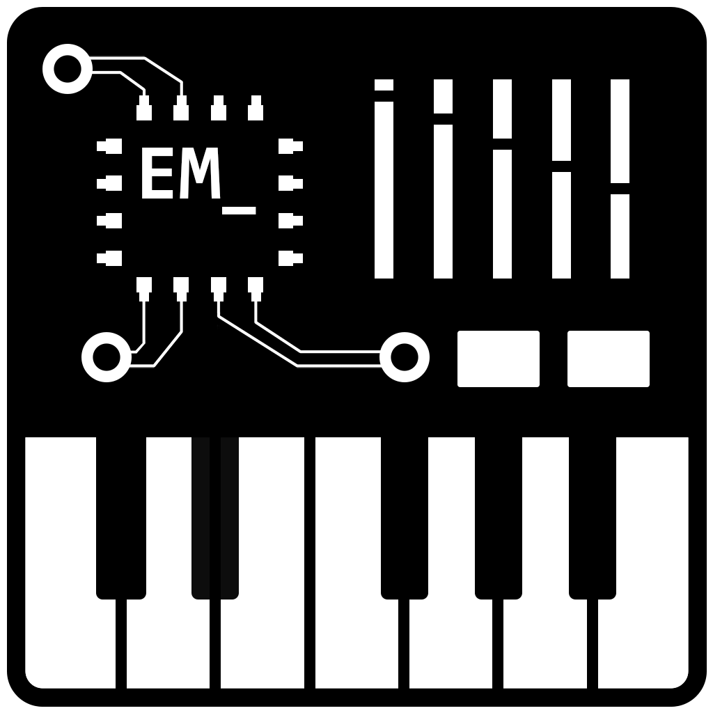
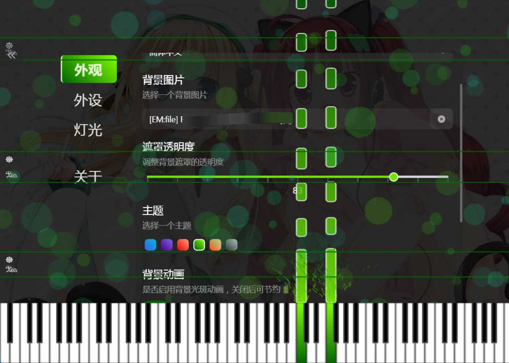
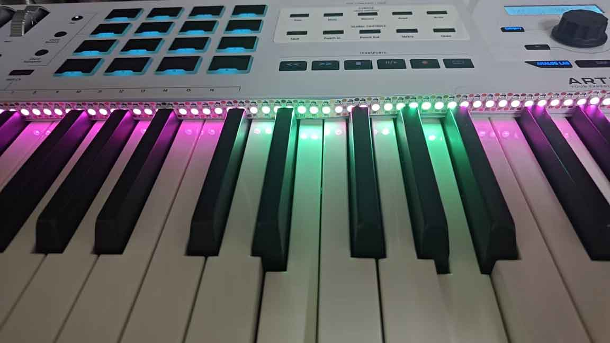
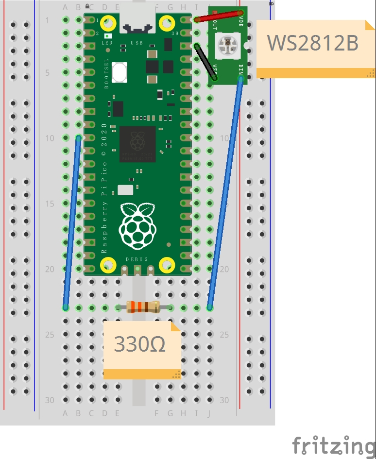
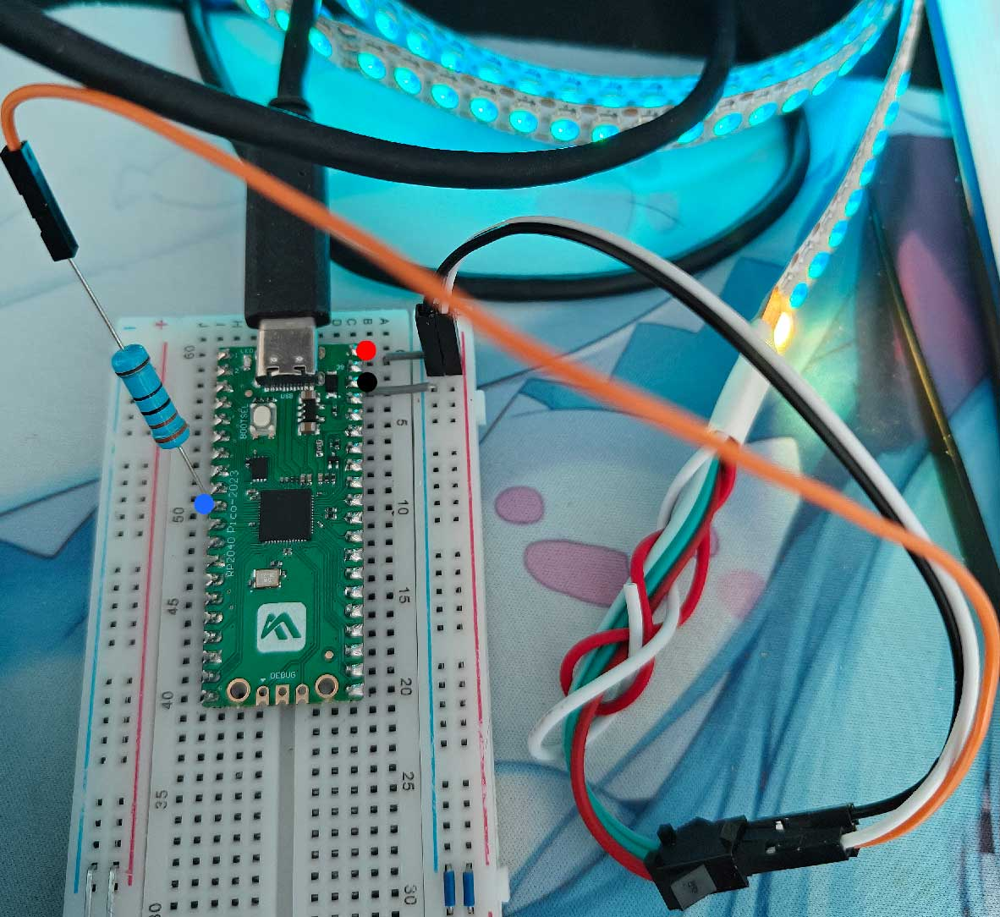
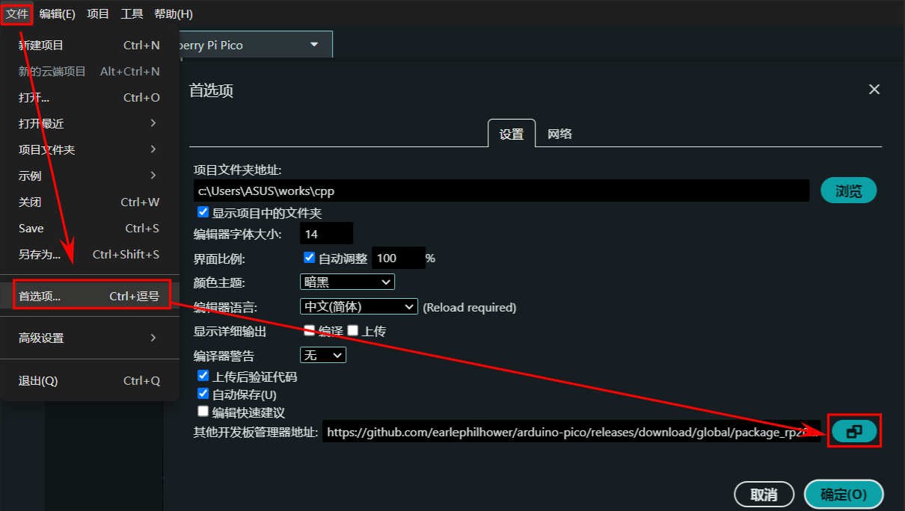
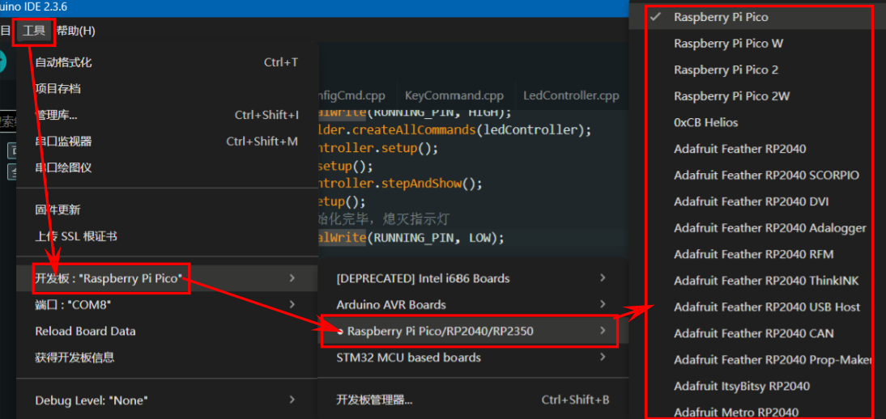
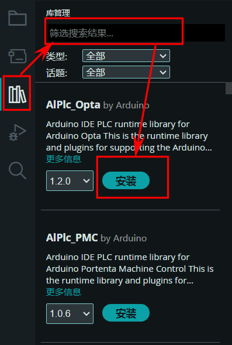
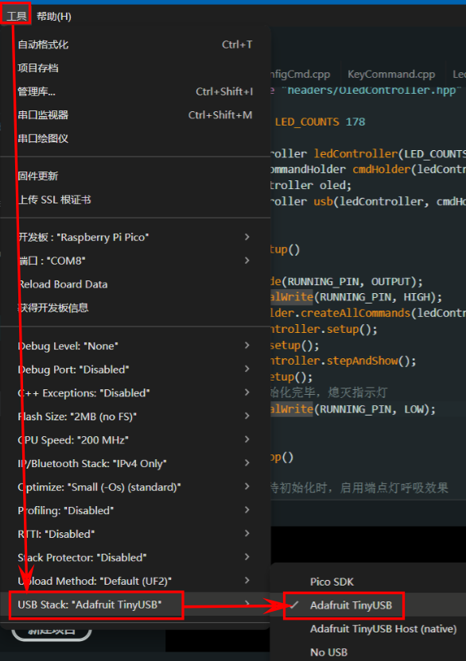
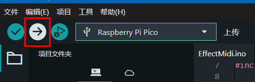

# EffectMidi

<h5 align="center">使用 <a href="https://electron-vite.org/">electron-vite</a> 构建，采用<a href="https://www.typescriptlang.org/">Typescript</a> + <a href="https://react.dev/">React</a> 开发，并依赖<a href="https://www.arduino.cc/">Arduino</a>平台运行</h5></em>

  
  

## 说明

本项目受[Effect_Piano_light_controller](https://github.com/esun-z/Effect_Piano_light_controller)启发，通过桌面端控制 MIDI 键盘的外置灯光效果，通过读取 MIDI 键盘输入，控制灯带的效果。

### 特性

所有配置均会保存到用户 `home` 目录的 `.effect-midi` 目录下，比如一个最常见的路径为 `C:/Users/Administrator/.effect-midi`，或者将其中的 `Administrator` 替换为你的用户名。

而 `effect-midi.db` 数据库文件会保存在其中，便携版、安装版均从中读取配置，它是一个明文的 SQLite 数据库文件，你可以使用任何数据库管理工具打开它，查看其中的配置。

本程序提供以下功能：

+ **✨界面外观设置**：（控制端）背景图、颜色主题、背景动画、点击动画、音符瀑布
+ **⚙️设备连接**：支持选择生效的 MIDI 设备和串口设备（串口选择后需要手动启用）
+ **🌈效果设置**：支持设置灯带背景色、前景色、端点灯颜色、扩散宽度、延迟时间

控制端除底部键盘组件外，其他组件均可折叠（左上角折叠按钮），折叠后可以更好的展示键盘音符瀑布。

[更多功能介绍、项目概览](https://mori.plus/archives/effect-midi-01)

[使用本项目制作的视频效果](https://www.bilibili.com/video/BV1D4ZFYqEaF/?share_source=copy_web&vd_source=a5261a3226919a8b0f0b47bb707e4e71)

## 使用方法

### 硬件清单

- **开发板**：
  - RP Pico/RP2040 系列：性价比高，测试通过，可以使用当前项目完整功能
  - Arduino Uno R3：不支持 USB HID，需使用 `deprecated_serial` 分支代码获取基于串口通信的历史兼容，实际测试使用体验较差，因串口数据概率性丢失问题，导致频繁出现延迟、丢失等问题
  - Arduino Mega 2560：待测试
  - ESP32：待测试，已确认 USB HID 受支持，预计可以使用当前项目完整功能
  - STM32：待测试
- **WS2812B 灯带**：程序兼容的规格为144灯/m（一个键对应两个灯），共需要178个灯珠（2端点灯+88×2），通常需要购买两米的灯带后剪掉多余的灯珠
- **MIDI 键盘**：88键 MIDI 键盘，可以是电子琴、MIDI 键盘等（少于88键的键盘也可以使用，没有测试）
- **导线**：最简方案需要 2 根公对公杜邦线，1 根公对母杜邦线
- **330Ω 电阻**：建议范围（220Ω-470Ω）有助于保护元件、增加信号稳定性；如实在没有不使用也可以，但不推荐

### 连线方案

RP2040 系列，此外提供了 Fritzing 项目文件（`doc/effect-midi.rp2040.fzz`）：

因为本项目的方案下，开发板直连电 PC，通常不需要外接电源

如果 PC 供电不足也可以使用 5V 直流电源进行供电

### 程序烧录

1. 下载本项目的代码，[Releases](https://github.com/ChiruMori/EffectMidi/releases) 中提供 Arduino 项目代码，解压后可以使用
2. 使用 Arduino IDE 打开解压后的 `EffectMidi/EffectMidi.ino`，注意，项目代码非单文件，如果拷贝到其他目录，需要保持目录结构（`EffectMidi` 目录下文件完整）
3. 安装对应开发板管理器（RP2040）：打开 Aruino IDE -> `文件` -> `首选项` -> `其他开发板管理器网址`，添加以下网址：`https://github.com/earlephilhower/arduino-pico/releases/download/global/package_rp2040_index.json`
   
4. 点击确定，等待下载完毕
5. 选择开发板：`工具` -> `开发板` -> 选择 `Raspberry Pi Pico` -> 对应型号的开发板
   
6. 安装依赖库：`工具` -> `管理库` -> 搜索 `FastLED` 和 `Adafruit TinyUSB Library` -> 安装，如果需要 OLED 显示（需修改代码，仅测试使用，无实际功能），搜索 `Adafruit SSD1306` 和 `Adafruit GFX Library` 进行安装
   
7. 选择 USB 方案：`工具` -> `USB Stack` -> 选择 `Adafruit TinyUSB`
   
8. 编译并上传：点击左上角的 `上传`
  
9.  端点灯缓慢闪烁，表示程序正常启动，等待控制端连接

### 控制端程序

访问本项目的 [Releases](https://github.com/ChiruMori/EffectMidi/releases) 页面下载合适的版本，解压后运行 `EffectMidi.exe` 按照提示使用即可。

## 工作原理

### EffectMidi 主程序

1. Windows 控制端读取 MIDI 输入设备的 MIDI 信号
2. Windows 控制端通过 USB 串口发送指定的信号到嵌入式端
3. 嵌入式端接受控制信号后控制 LED 的效果

## 开发环境

### 硬件设备

参考[硬件清单](#硬件清单)

### PC 控制端

项目使用 [electron-vite](https://electron-vite.org/config/) 构建，推荐使用 [Visual Studio Code](https://code.visualstudio.com/) 编辑器（并建议安装 `Tailwind CSS IntelliSense`, `Prettier - Code formatter`, `EditorConfig for VS Code`, `stylus`）。

开发环境下，启动后可以通过 `F12` 打开开发者工具。

- `pnpm install` 安装依赖，期间如果出现奇怪的报错，可以尝试 pnpm 8.x.x 版本
- `pnpm dev` 启动开发环境
- `pnpm build:win` 打包 Windows 版本
- `pnpm build:mac` 打包 macOS 版本
- `pnpm build:linux` 打包 Linux 版本

### 开发板端

推荐使用 [Arduino IDE](https://www.arduino.cc/en/software)，或者您习惯使用的具备开发板烧录功能的 IDE。

依赖下列库：

- [FastLED](https://fastled.io/) - 必须，用于控制灯带
- [Adafruit_TinyUSB](https://github.com/adafruit/Adafruit_TinyUSB_Arduino) - 必须，用于USB通信，如果不需要此部分功能，可能需要手动删除相关代码，安装后，需要手动在 `Arduino IDE` -> `工具` -> `USB Stack` 中选择 `Adafruit TinyUSB`

- - -

开发环境下，可以通过启用 `#define USE_OLED` 激活调试信息展示，也可以从源码里彻底删除有关代码来释放一部分性能，连接方式：

+ `SDA` -> `SDA`（GP4）
+ `SCL` -> `SCL`（GP5）
+ `GND` -> `GND`
+ `VCC` -> `5V`

> 注意，如果使用的开发板内存较小（如 Arduino Uno R3），OLED 可能不工作。

依赖的库：

- [Adafruit_GFX](https://github.com/adafruit/Adafruit-GFX-Library)
- [Adafruit_SSD1306](https://github.com/adafruit/Adafruit_SSD1306)

## 开源声明

本项目采用 **[GNU GPL v3](LICENSE) 协议**，沿用原项目的开源协议，保留更换权利

本项目继承自 [Effect_Piano_light_controller](https://github.com/esun-z/Effect_Piano_light_controller) 的代码仅存在于 `effect_piano_refactor` 分支，主分支代码为全新实现。

- - -

本项目使用以下 USB 标识符：

> 如果与其他设备使用了相同的标识符，则该设备也会出现在本程序的设备列表中。

- **VID**: `0x1209` ([PID.org](https://pid.codes/1209/)分配的开源标识)
- **PID**: `0x0666` (项目自定义标识)
