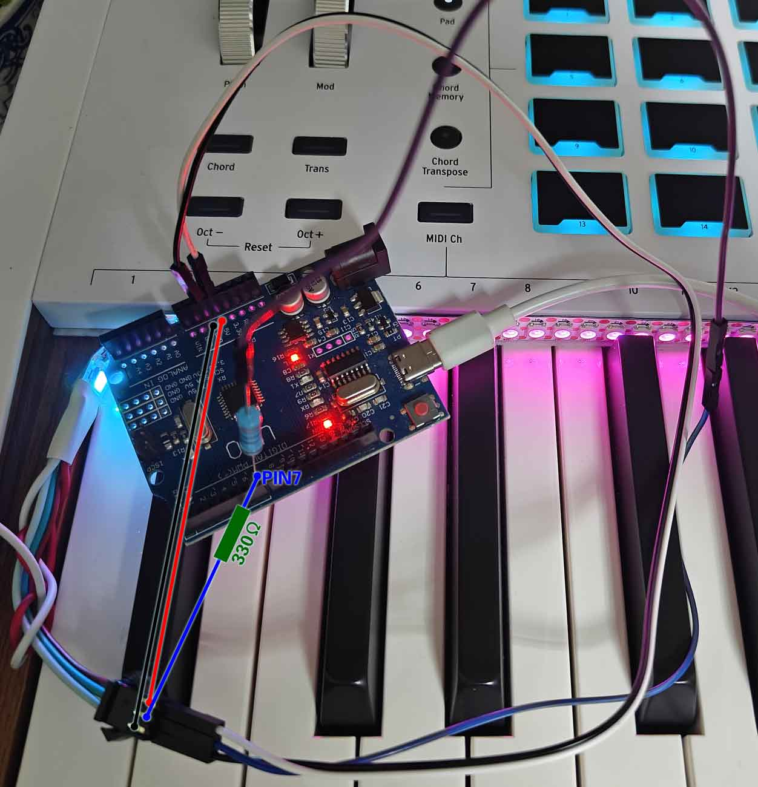

# EffectMidi

<h5 align="center">使用 <a href="https://electron-vite.org/">electron-vite</a> 构建，采用<a href="https://www.typescriptlang.org/">Typescript</a> + <a href="https://react.dev/">React</a> 开发，并依赖<a href="https://www.arduino.cc/">Arduino</a>平台运行</h5></em>

## 说明

本项目受[Effect_Piano_light_controller](https://github.com/esun-z/Effect_Piano_light_controller)启发，通过桌面端控制 MIDI 键盘的外置灯光效果，通过读取 MIDI 键盘输入，控制灯带的效果。

### 特性

所有配置均会保存在程序目录下的 `effect-midi.db` 数据库文件中，在传递本程序时，可以带上这个文件以保留配置。

本程序提供以下功能：

+ **✨界面外观设置**：（控制端）背景图、颜色主题、背景动画、点击动画、音符瀑布
+ **⚙️设备连接**：支持选择生效的 MIDI 设备和串口设备（串口选择后需要手动启用）
+ **🌈效果设置**：支持设置灯带背景色、前景色、端点灯颜色、扩散宽度、延迟时间

控制端除底部键盘组件外，其他组件均可折叠（左上角折叠按钮），折叠后可以更好的展示键盘音符瀑布。

[更多功能介绍、项目概览](https://mori.plus/archives/effect-midi-01)

## 使用方法

### 硬件清单

- **Arduino 开发板**：最简使用可以选择 Arduino Uno R3。（如果需要进行开发，或者考虑后续可能的功能升级，推荐使用更高性能的开发板，比如 Arduino Mega 2560）
- **WS2812B 灯带**：程序兼容的规格为144灯/m（一个键对应两个灯），共需要178个灯珠（2端点灯+88×2），通常需要购买两米的灯带后剪掉多余的灯珠
- **MIDI 键盘**：88键 MIDI 键盘，可以是电子琴、MIDI 键盘等（少于88键的键盘也可以使用，没有测试）
- **导线**：最简方案需要 2 根公对公杜邦线，1 根公对母杜邦线
- **330Ω 电阻**

### 连线方案

参考[arduino 控制 ws2812b 教程](https://howtomechatronics.com/tutorials/arduino/how-to-control-ws2812b-individually-addressable-leds-using-arduino/)

因为本项目的方案下，开发板直连电脑，所以连线方案中的外接电源可以省略。

### 程序烧录

1. 下载本项目的代码
2. 使用 Arduino IDE 打开 `arduino/EffectMidi/EffectMidi.ino`，注意，项目代码非单文件，如果拷贝到其他目录，需要保持目录结构（`EffectMidi` 目录下文件完整）
3. 更新驱动：打开设备管理器，找到 `端口（COM 和 LPT）` 下的 `USB-SERIAL CH340`，右键更新驱动，选择手动更新，选择 `arduino/drivers` 目录下的驱动
4. 选择开发板：`工具` -> `开发板` -> `Arduino Uno`
5. 选择端口：`工具` -> `端口` -> 选择 `COM` 开头的端口
6. 安装依赖库：`工具` -> `管理库` -> 搜索 `FastLED` -> 安装，如果需要 OLED 显示（需修改代码，仅测试使用，无实际功能），搜索 `Adafruit SSD1306` 和 `Adafruit GFX Library` 进行安装
7. 编译并上传：点击左上角的 `上传`
8. 端点灯缓慢闪烁，表示程序正常运行，等待控制端连接

### 控制端程序

访问本项目的 [Releases](https://github.com/ChiruMori/EffectMidi/releases) 页面下载合适的版本，解压后运行 `EffectMidi.exe` 按照提示使用即可。

## 工作原理

1. Windows 控制端读取 MIDI 输入设备的 MIDI 信号
2. Windows 控制端通过 USB 串口发送指定的信号到 Arduino 开发板
3. Arduino 开发板接受控制信号后控制 LED 的效果

## 开发环境

### 硬件设备

硬件设备同上，不推荐使用较低性能的开发板

### PC 控制端

项目使用 [electron-vite](https://electron-vite.org/config/) 构建，推荐使用 [Visual Studio Code](https://code.visualstudio.com/) 编辑器（并建议安装 `Tailwind CSS IntelliSense`, `Prettier - Code formatter`, `EditorConfig for VS Code`, `stylus`）。

开发环境下，启动后可以通过 `F12` 打开开发者工具。

- `pnpm install` 安装依赖，期间如果出现奇怪的报错，可以尝试 pnpm 8.x.x 版本
- `pnpm dev` 启动开发环境
- `pnpm build:win` 打包 Windows 版本
- `pnpm build:mac` 打包 macOS 版本
- `pnpm build:linux` 打包 Linux 版本

### Arduino 开发板端

推荐使用 [Arduino IDE](https://www.arduino.cc/en/software)。暂未发现 VSCode 上 Arduino 的合适插件，仍需依赖 Arduino IDE 完成开发（解决依赖、验证编译、上传）。

依赖下列库：

- [FastLED](https://fastled.io/) - 必须，用于控制灯带

开发环境下，可以通过启用 `#define USE_OLED` 激活调试信息展示，也可以从源码里彻底删除有关代码来释放一部分性能，连接方式：

+ `SDA` -> `SDA`
+ `SCL` -> `SCL`
+ `GND` -> `GND`
+ `VCC` -> `5V`

> 注意，如果使用的开发板内存较小，OLED 可能不工作。

依赖的库：

- [Adafruit_GFX](https://github.com/adafruit/Adafruit-GFX-Library)
- [Adafruit_SSD1306](https://github.com/adafruit/Adafruit_SSD1306)

